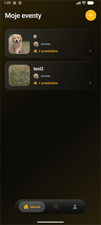
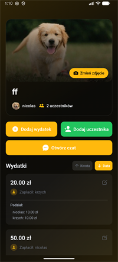
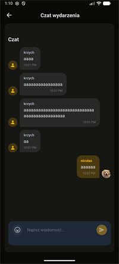
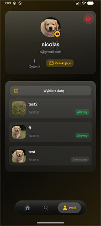

# Billow Mobile

Aplikacja mobilna **Billow** — narzędzie do wspólnego rozliczania wydatków w grupie. Użytkownicy tworzą eventy (np. wyjazd, impreza, wspólne zakupy), dodają wydatki, dzielą koszty między uczestników i widzą kto komu ile jest winien. Aplikacja komunikuje się z backendem **billow_backend** przez REST API i WebSocket.

## Spis treści

- [Funkcjonalności](#funkcjonalności)
- [Technologie i biblioteki](#technologie-i-biblioteki)
- [Struktura projektu](#struktura-projektu)
- [Wymagania](#wymagania)
- [Konfiguracja](#konfiguracja)
- [Uruchomienie](#uruchomienie)
- [Budowanie (EAS)](#budowanie-eas)

---

## Funkcjonalności

### Główna — lista eventów (`home`)

Ekran startowy z listą aktywnych eventów użytkownika. Każda karta pokazuje zdjęcie, nazwę, twórcę i liczbę uczestników. Przycisk **+** umożliwia szybkie utworzenie nowego eventu.

<p align="left">
  
</p>

- Lista aktywnych eventów z paginacją (nieskończone przewijanie)
- Tworzenie nowego eventu z nazwą, opisem i zaproszeniem znajomych
- Dolna nawigacja: Główna, Szukaj, Profil

---

### Szczegóły eventu (`event`)

Widok pojedynczego eventu z okładką, listą uczestników i wydatkami. Twórca może dodawać wydatki, zapraszać uczestników i otwierać czat grupowy.

<p align="left">
  
</p>

- Szczegóły eventu: uczestnicy, status, data utworzenia, zdjęcie okładki
- Dodawanie uczestników spośród znajomych (tylko twórca eventu)
- Zakończenie eventu przez twórcę
- Upload i edycja zdjęcia okładki eventu
- Dodawanie wydatków z kwotą, opisem, płatnikiem i podziałem między uczestników
- Edycja i usuwanie wydatków (zależnie od uprawnień)
- Sortowanie listy wydatków: po kwocie lub dacie (rosnąco / malejąco)

---

### Czat eventowy (`chat`)

Grupowy czat przypisany do eventu. Wiadomości w czasie rzeczywistym przez WebSocket, z obsługą emoji i historią wiadomości.

<p align="left">
  
</p>

- Komunikacja w czasie rzeczywistym przez WebSocket
- Historia wiadomości z paginacją (ładowanie starszych wiadomości)
- Picker emoji
- Automatyczne ponowne łączenie po utracie połączenia

---

### Profil użytkownika (`profile`)

Profil z avatarem, danymi konta, liczbą znajomych i historią eventów (aktywne i zakończone). Możliwość zmiany zdjęcia profilowego i zarządzania zaproszeniami.

<p align="left">
  
</p>

- Wyświetlanie nazwy, e-maila i liczby znajomych
- Upload avatara z galerii lub aparatu
- Lista eventów użytkownika ze statusem (aktywny / zakończony)
- Oczekujące zaproszenia do znajomych
- Wylogowanie z potwierdzeniem

---

### Podsumowanie rozliczeń (`summary`)

Modal z saldem netto każdego uczestnika oraz optymalnymi przelewami — kto komu ile powinien zapłacić po rozliczeniu wszystkich wydatków.

<p align="left">
  
</p>

- Saldo netto per uczestnik (+ wierzysz / − jesteś winien)
- Automatyczne obliczanie optymalnych przelewów między uczestnikami
- Wyświetlanie kwot w PLN

---

### Uwierzytelnianie

- Rejestracja i logowanie użytkownika
- Sesja oparta na tokenach JWT (access + refresh)
- Automatyczne odświeżanie tokenu przed wygaśnięciem
- Bezpieczne przechowywanie tokenów w `expo-secure-store`
- Ochrona tras — niezalogowany użytkownik jest przekierowywany na ekran logowania

### Znajomi

- Wyszukiwanie użytkowników po nazwie (min. 2 znaki, z debouncingiem)
- Wysyłanie zaproszeń do znajomych
- Akceptacja i odrzucanie otrzymanych zaproszeń
- Lista znajomych z licznikiem na profilu
- Zapraszanie znajomych do eventów przy tworzeniu

### Interfejs użytkownika

- Ciemny motyw z gradientowym tłem (kolor akcentu: `#FFB90D`)
- Własny dolny pasek nawigacji (3 zakładki: Główna, Szukaj, Profil)
- Animacje przycisków i płynne wejścia elementów (`react-native-reanimated`)
- Skeleton loadery podczas ładowania danych
- Responsywny layout (dostosowanie do mniejszych ekranów)
- Haptic feedback przy interakcjach

---

## Technologie i biblioteki

### Rdzeń

| Biblioteka | Wersja | Zastosowanie |
|---|---|---|
| [Expo](https://expo.dev/) | 56 | Framework mobilny, narzędzia buildowe |
| [React Native](https://reactnative.dev/) | 0.85 | Aplikacja natywna iOS / Android |
| [React](https://react.dev/) | 19 | UI |
| [TypeScript](https://www.typescriptlang.org/) | 6 | Typowanie statyczne |
| [Expo Router](https://docs.expo.dev/router/introduction/) | 56 | Nawigacja oparta na plikach (file-based routing) |

### Stan i dane

| Biblioteka | Zastosowanie |
|---|---|
| [@tanstack/react-query](https://tanstack.com/query) | Cache, pobieranie i synchronizacja danych z API |
| `AuthContext` (React Context) | Zarządzanie sesją i autoryzowanymi żądaniami HTTP |

### Nawigacja i UI

| Biblioteka | Zastosowanie |
|---|---|
| `@react-navigation/bottom-tabs` | Zakładki dolne |
| `react-native-safe-area-context` | Bezpieczne obszary ekranu (notch, pasek systemowy) |
| `react-native-screens` | Natywne ekrany nawigacji |
| `react-native-gesture-handler` | Obsługa gestów |
| `react-native-reanimated` | Animacje wydajnościowe |
| `react-native-worklets` | Worklety dla Reanimated |
| `@expo/vector-icons` (Ionicons) | Ikony |
| `expo-linear-gradient` | Gradientowe tła |
| `expo-blur` | Efekt rozmycia (np. wyszukiwarka) |
| `expo-haptics` | Wibracje haptyczne |
| `expo-status-bar` | Pasek statusu |

### Media i pliki

| Biblioteka | Zastosowanie |
|---|---|
| `expo-image` | Optymalizowane wyświetlanie obrazów |
| `expo-image-picker` | Wybór zdjęć z galerii / aparatu |
| `expo-image-manipulator` | Przetwarzanie obrazów przed uploadem |
| `expo-file-system` | Operacje na plikach lokalnych |

### Bezpieczeństwo i konfiguracja

| Biblioteka | Zastosowanie |
|---|---|
| `expo-secure-store` | Bezpieczne przechowywanie tokenów JWT |
| `expo-constants` | Stałe środowiskowe aplikacji |
| `expo-linking` | Deep linki (`billow://`) |
| `expo-web-browser` | Otwieranie linków w przeglądarce |

### Formularze i interakcje

| Biblioteka | Zastosowanie |
|---|---|
| `@react-native-community/datetimepicker` | Wybór daty i czasu |
| `react-native-keyboard-aware-scroll-view` | Przewijanie z uwzględnieniem klawiatury |

### Komunikacja z backendem

| Mechanizm | Zastosowanie |
|---|---|
| REST API (`fetch`) | Wszystkie operacje CRUD (auth, eventy, wydatki, znajomi, media) |
| WebSocket | Czat eventowy w czasie rzeczywistym |

### Narzędzia deweloperskie

| Biblioteka | Zastosowanie |
|---|---|
| ESLint + `eslint-config-expo` | Linting kodu |
| EAS Build (`eas.json`) | Budowanie aplikacji na iOS / Android |

---

## Struktura projektu

```
billow_mobile/
├── app/                    # Ekrany (Expo Router)
│   ├── (auth)/             # Logowanie, rejestracja
│   ├── (tabs)/             # Główna, Szukaj, Profil
│   └── event/[id]/         # Szczegóły eventu, czat
├── api/                    # Klienty API (auth, events, expenses, friends, chat, media)
├── components/             # Komponenty UI (eventy, znajomi, modale, skeletony)
├── context/                # AuthContext — sesja użytkownika
├── hooks/                  # Logika biznesowa (React Query + custom hooks)
├── providers/              # QueryProvider (TanStack Query)
├── types/                  # Typy TypeScript (modele API)
├── urls/                   # Adresy endpointów backendu
├── utils/                  # Funkcje pomocnicze
├── screens/                # Zrzuty ekranu aplikacji (README)
└── assets/                 # Ikony, obrazy, czcionki
```

---

## Wymagania

- [Node.js](https://nodejs.org/) (LTS)
- npm
- [Expo CLI](https://docs.expo.dev/get-started/installation/)
- Działający backend **billow_backend** (domyślnie port `8082`)
- Do uruchomienia na urządzeniu fizycznym: [Expo Go](https://expo.dev/go) lub build deweloperski

---

## Konfiguracja

Adres API backendu ustawiasz w pliku `urls/urls.ts`:

```typescript
export const API_BASE_URL = "http://192.168.1.167:8082";
```

Zmień adres IP na adres komputera, na którym działa backend (w sieci lokalnej) lub na URL produkcyjny.

> **Uwaga:** Urządzenie mobilne musi mieć dostęp do hosta API. Przy emulatorze Androida możesz użyć `10.0.2.2` zamiast `localhost`.

---

## Uruchomienie

```bash
# Instalacja zależności
npm install

# Uruchomienie serwera deweloperskiego Expo
npm start

# Uruchomienie na Androidzie (natywny build)
npm run android

# Uruchomienie na iOS (macOS)
npm run ios

# Uruchomienie w przeglądarce
npm run web

# Linting
npm run lint
```

Po `npm start` zeskanuj kod QR w aplikacji Expo Go lub wybierz emulator z menu deweloperskiego.

---

## Budowanie (EAS)

Projekt jest skonfigurowany do budowania przez [EAS Build](https://docs.expo.dev/build/introduction/):

| Profil | Opis |
|---|---|
| `development` | Build deweloperski z development client |
| `preview` | Build wewnętrzny (testowanie) |
| `production` | Build produkcyjny z auto-increment wersji |

```bash
# Build produkcyjny
eas build --profile production --platform android
eas build --profile production --platform ios
```

---

## Powiązane repozytoria

- **billow_backend** — API REST + WebSocket (Go)
- **docker-compose.yml** — uruchomienie całego środowiska lokalnego
